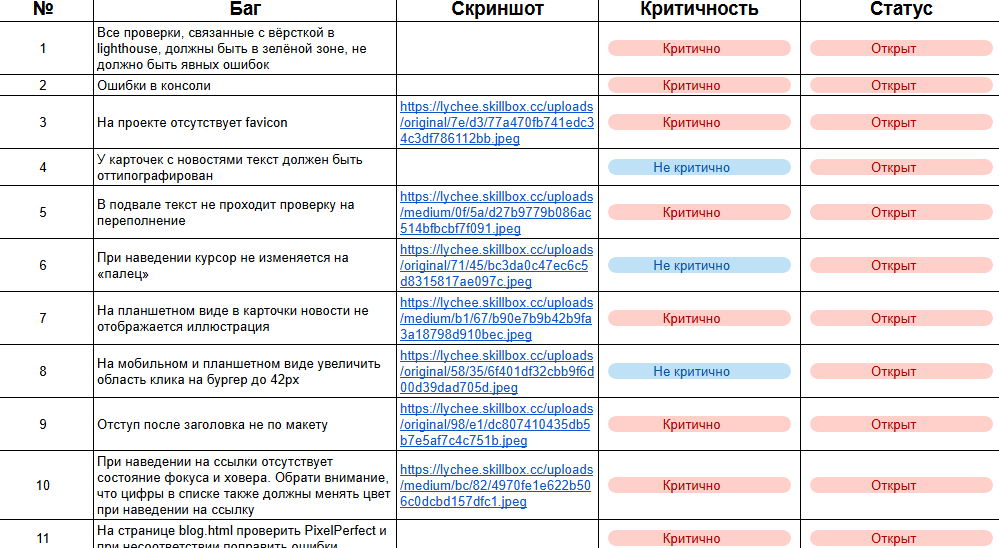
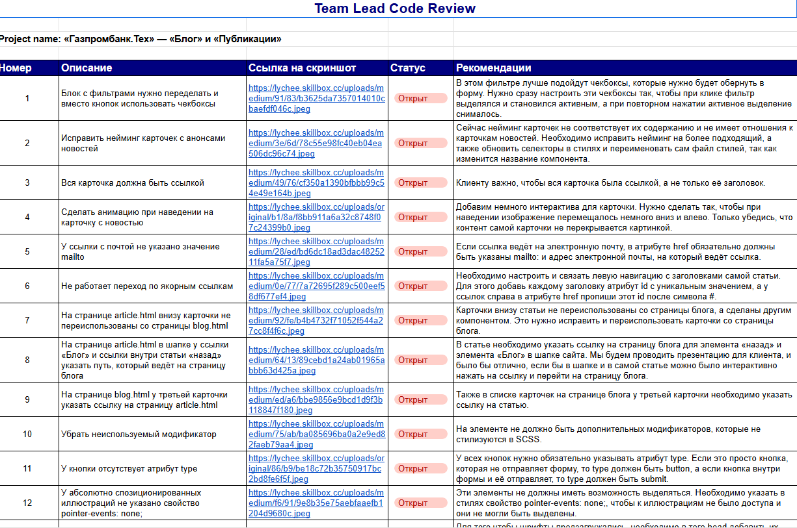

# the-Blog-and-Publications-pages
Предрелизная подготовка страниц «Блог» и «Публикации» для сайта «Газпромбанк.Тех»

# Описание проекта

## Обзор

Этот проект разработан с учетом современных стандартов веб-разработки, обеспечивая адаптивность, производительность и удобство использования. В проекте реализована "резиновая" верстка, семантическая структура и оптимизация графики.

## Технические характеристики

### Адаптивность и отзывчивость

*   **Резиновая верстка**: Обеспечивает корректное отображение на экранах с шириной от 360 до 4000 пикселей.
*   **Адаптация под макет**: Верстка адаптирована под все разрешения, указанные в дизайн-макете.
*   **Медиа-запросы**: Используются медиа-запросы для адаптации элементов интерфейса к различным размерам экрана.

### Оптимизация графики

*   **Растровые изображения**: Подготовлены для экранов с высокой плотностью пикселей (2x).
*   **Адаптивные изображения**: Изображения подключены с учетом их адаптации под различные устройства.
*   **Векторная графика**: Векторные изображения добавлены в спрайт для уменьшения количества HTTP-запросов.
*   **Формат изображений**: Графика выбрана в оптимальном формате (JPG, PNG или SVG) в зависимости от типа изображения.

### Стилизация и структура

*   **Препроцессор Sass**: Стилизация выполнена с использованием препроцессора Sass для удобства поддержки и расширяемости.
*   **SCSS-переменные**: Семейства шрифтов и цвета определены в SCSS-переменных для обеспечения консистентности стилей.
*   **UI-kit**: Сформированы все состояния элементов интерфейса на основе предоставленного UI-kit.
*   **БЭМ**: Верстка создана с использованием методологии БЭМ (Блочно-элементная методология) для модульности и переиспользования компонентов.
*   **Семантическая разметка**: Разметка сформирована с использованием семантических HTML5-тегов для улучшения доступности и SEO.
*   **Структура разделов**: Основное содержимое страницы организовано в разделы (`<section>`), обернутые в тег `<main>`.
*   **Контейнер**: Горизонтальная центровка контента в разделах выполняется с помощью утилитарного класса `
`.

### Формы

*   **Тег `<form>`**: Все поля формы находятся внутри тега `<form>`.
*   **Атрибут `required`**: Обязательные поля помечены атрибутом `required`.
*   **Атрибуты `name` и `id`**: Полям формы присвоены атрибуты `name` и `id`, а радиокнопкам — атрибут `value`.
*   **Атрибут `type`**: У кнопки отправки формы корректно указан атрибут `type`.

### Интерактивность и доступность

*   **Область взаимодействия**: Область взаимодействия с интерактивными элементами предсказуема и достаточна для удобства пользователя.
*   **Визуальный отклик**: Интерактивные элементы имеют визуальный отклик при фокусировке с клавиатуры.
*   **Текстовые подписи**: У всех интерактивных элементов есть явная или скрытая текстовая подпись для улучшения доступности.
*   **Скрытый заголовок**: Добавлен скрытый заголовок при отсутствии подходящего заголовка в макете для улучшения семантики.

### Производительность и оптимизация

*   **Вес селекторов**: Избежано избыточного увеличения веса селекторов CSS.
*   **Отключение кликабельности**: У спозиционированных графических элементов отключена кликабельность с помощью `pointer-events: none;`.

### Соответствие макету

*   **Pixel Perfect**: Верстка соответствует макету с учетом проверки по Pixel Perfect (погрешность не более 10 пикселей).
*   **Типографика**: Текст прошел обработку типографом для улучшения читаемости и визуального восприятия.

### Валидация и структура проекта

*   **Файловая структура**: Соблюдена логичная файловая структура проекта.
*   **Форматирование кода**: Код отформатирован для улучшения читаемости и поддержки.
*   **Валидация**: Верстка прошла проверку на валидность с использованием HTML-валидатора и БЭМ-валидатора.

### Дополнительные проверки

*   **Переполнение контентом**: Верстка проверена на переполнение контентом.
*   **Прижатый подвал**: При недостаточной высоте основного содержимого подвал страницы прижат к низу экрана.
*   **Ссылки**: Всем ссылкам задано значение `#` в атрибуте `href`.

### Баг-лист

### Чек-лист самотестирования

https://api.selcdn.ru/v1/SEL_72086/prodLMS/files/public/%D0%9E%D0%B1%D1%89%D0%B8%D0%B9_%D1%87%D0%B5%D0%BA-%D0%BB%D0%B8%D1%81%D1%82_%D0%BF%D1%80%D0%BE%D0%B2%D0%B5%D1%80%D0%BA%D0%B8_%D1%81%D0%B0%D0%B9%D1%82%D0%B0_%D0%BF%D1%80%D0%B8_%D1%81%D0%B0%D0%BC%D0%BE%D1%82%D0%B5%D1%81%D1%82%D0%B8%D1%80%D0%BE%D0%B2%D0%B0%D0%BD%D0%B8%D0%B8_NWHjIpe.pdf